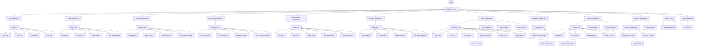

# Screen Flow cho Admin - MamaFit System

Sơ đồ luồng màn hình cho vai trò Admin trong hệ thống MamaFit theo format chuẩn.

```mermaid
flowchart TD
    Start([Login]) --> Dashboard[Dashboard Admin]
    
    %% Main navigation from Dashboard
    Dashboard --> UserManagement[User Management]
    Dashboard --> BranchManagement[Branch Management]
    Dashboard --> CategoryManagement[Category Management]
    Dashboard --> ComponentManagement[Component Management]
    Dashboard --> MaternityDressManagement[Maternity Dress Management]
    Dashboard --> MilestoneManagement[Milestone Management]
    Dashboard --> OrderManagement[Order Management]
    Dashboard --> TransactionManagement[Transaction Management]
    Dashboard --> VoucherManagement[Voucher Management]
    Dashboard --> WarrantyManagement[Warranty Management]
    Dashboard --> SystemConfig[System Config]
    Dashboard --> StyleManagement[Style Management]
    
    %% User Management Flow
    UserManagement --> UserList[User List]
    UserList --> AddUser[Add User]
    UserList --> EditUser[Edit User]
    UserList --> DeleteUser[Delete User]
    UserList --> InviteUser[Invite User]
    
    %% Branch Management Flow
    BranchManagement --> BranchList[Branch List]
    BranchList --> AddBranch[Add Branch]
    BranchList --> EditBranch[Edit Branch]
    BranchList --> DeleteBranch[Delete Branch]
    BranchList --> ViewBranch[View Branch Details]
    
    %% Category Management Flow
    CategoryManagement --> CategoryList[Category List]
    CategoryList --> AddCategory[Add Category]
    CategoryList --> EditCategory[Edit Category]
    CategoryList --> DeleteCategory[Delete Category]
    CategoryList --> ViewCategory[View Category Details]
    
    %% Component Management Flow
    ComponentManagement --> ComponentList[Component List]
    ComponentList --> AddComponent[Add Component]
    ComponentList --> EditComponent[Edit Component]
    ComponentList --> DeleteComponent[Delete Component]
    ComponentList --> ViewComponent[View Component Details]
    
    %% Maternity Dress Management Flow
    MaternityDressManagement --> DressList[Dress List]
    DressList --> AddDress[Add Dress]
    DressList --> EditDress[Edit Dress]
    DressList --> DeleteDress[Delete Dress]
    DressList --> ViewDress[View Dress Details]
    DressList --> AllocateDress[Allocate to Branch]
    
    %% Milestone Management Flow
    MilestoneManagement --> MilestoneList[Milestone List]
    MilestoneList --> AddMilestone[Add Milestone]
    MilestoneList --> EditMilestone[Edit Milestone]
    MilestoneList --> DeleteMilestone[Delete Milestone]
    MilestoneList --> ViewMilestone[View Milestone Details]
    
    %% Order Management Flow
    OrderManagement --> OrderList[Order List]
    OrderList --> AddOrder[Add Order]
    OrderList --> EditOrder[Edit Order]
    OrderList --> DeleteOrder[Delete Order]
    OrderList --> ViewOrder[View Order Details]
    OrderList --> AssignOrder[Assign Order]
    OrderList --> UpdateStatus[Update Status]
    OrderManagement --> DesignRequest[Design Request]
    OrderManagement --> OrderWarranty[Order Warranty]
    OrderManagement --> OrderStatistics[Order Statistics]
    ViewOrder --> TrackOrder[Track Progress]
    ViewOrder --> OrderSidebar[Order Detail Sidebar]
    
    %% Transaction Management Flow
    TransactionManagement --> TransactionList[Transaction List]
    TransactionList --> ViewTransaction[View Transaction Details]
    
    %% Voucher Management Flow
    VoucherManagement --> VoucherList[Voucher List]
    VoucherList --> AddVoucher[Add Voucher]
    VoucherList --> EditVoucher[Edit Voucher]
    VoucherList --> DeleteVoucher[Delete Voucher]
    VoucherList --> AssignVoucher[Assign Voucher]
    VoucherManagement --> VoucherBatch[Voucher Batch]
    VoucherManagement --> VoucherDiscount[Voucher Discount]
    
    %% Warranty Management Flow
    WarrantyManagement --> WarrantyList[Warranty Request List]
    WarrantyList --> ViewWarranty[View Warranty Details]
    WarrantyList --> WarrantyDecision[Warranty Decision]
    WarrantyManagement --> WarrantyFilters[Warranty Filters]
    ViewWarranty --> RequestTypeBadge[Request Type Badge]
    ViewWarranty --> StatusBadge[Status Badge]
    
    %% System Config Flow
    SystemConfig --> ConfigSettings[View/Update Config]
    
    %% Style Management Flow
    StyleManagement --> StyleForm[Style Form]
    
    %% Return paths
    AddUser --> UserList
    EditUser --> UserList
    DeleteUser --> UserList
    InviteUser --> UserList
    
    AddBranch --> BranchList
    EditBranch --> BranchList
    DeleteBranch --> BranchList
    ViewBranch --> BranchList
    
    AddCategory --> CategoryList
    EditCategory --> CategoryList
    DeleteCategory --> CategoryList
    ViewCategory --> CategoryList
    
    AddComponent --> ComponentList
    EditComponent --> ComponentList
    DeleteComponent --> ComponentList
    ViewComponent --> ComponentList
    
    AddDress --> DressList
    EditDress --> DressList
    DeleteDress --> DressList
    ViewDress --> DressList
    AllocateDress --> DressList
    
    AddMilestone --> MilestoneList
    EditMilestone --> MilestoneList
    DeleteMilestone --> MilestoneList
    ViewMilestone --> MilestoneList
    
    AddOrder --> OrderList
    EditOrder --> OrderList
    DeleteOrder --> OrderList
    ViewOrder --> OrderList
    AssignOrder --> OrderList
    UpdateStatus --> OrderList
    
    ViewTransaction --> TransactionList
    
    AddVoucher --> VoucherList
    EditVoucher --> VoucherList
    DeleteVoucher --> VoucherList
    AssignVoucher --> VoucherList
    
    ViewWarranty --> WarrantyList
    WarrantyDecision --> WarrantyList
    
    ConfigSettings --> SystemConfig
    StyleForm --> StyleManagement
```
